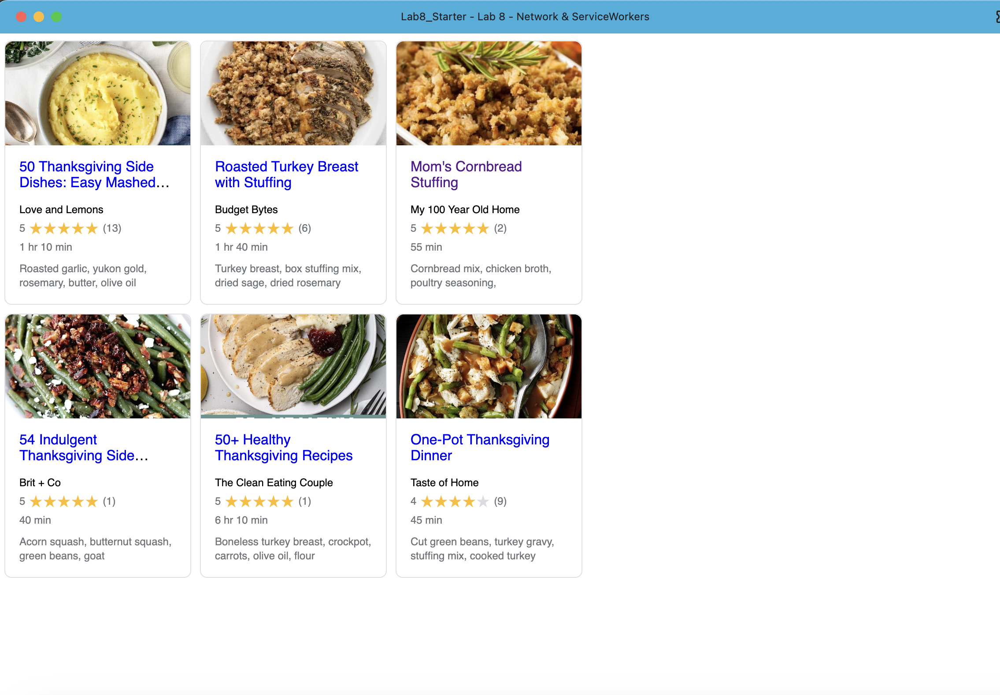

# Lab8-Starter

## Names of lab partner
- Xiaogeng Xu

## Deployed GitHub Pages URL
👉 [Github Page](https://octfog.github.io/Lab8_Starter/)

## Short paragraph about graceful degradation and service workers
Graceful degradation means building your website so it still works, even if something goes wrong—like if the internet is slow or not working at all. Service workers help with this by running in the background and saving parts of your website, like files and data, so they can be used later without needing the internet. This means that if someone opens your site without a connection, the service worker can still load saved content, letting the app keep working instead of breaking. So, service workers are a helpful tool to make sure your site handles bad internet in a smooth and user-friendly way.

## pwa.png
